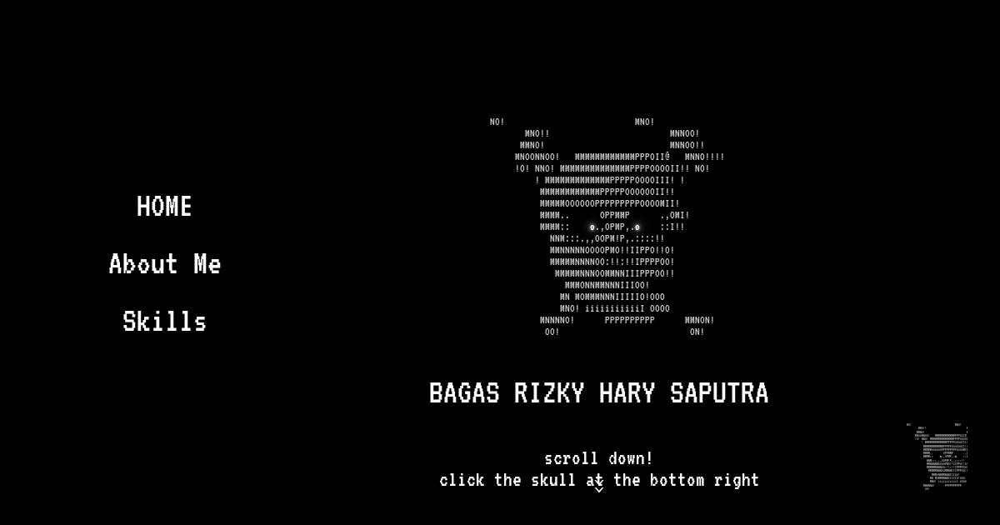

<div align="center">



# `~/bagasrizkyharysaputra`

**A terminal-flavoured personal portfolio** — a cybersecurity student who breaks binaries, writes exploits, and occasionally ships websites.

[](https://bagasrizkyharysaputra.vercel.app)
[](https://vuejs.org)
[](https://vite.dev)
[](#-license)

<sub>Built with nothing but vanilla CSS, one monospace font, and a lot of `cqw` units.</sub>

</div>

---

## // about

This is the source of my personal branding site. It is a single-page experience with a **CRT / terminal** aesthetic: pure line-art, an ASCII cat whose eyes follow your cursor, an achievement list that links straight to the proof, and a portfolio slider.

Everything you see — the drifting grid, scanlines, glows, orbiting skills, per-character text reveal — is hand-rolled. No UI framework, no animation library.

> **Focus:** binary exploitation & reverse engineering. **Side quest:** making a website that looks like it booted from a floppy disk.

---

## // features

- **ASCII logo with tracking eyes** — the cat pupils follow your mouse.
- **Circular radial nav** — the floating logo fans six line-art SVG buttons out along a computed ring (`cos/sin × radius`), so it stays proportional at any aspect ratio.
- **Per-character scroll reveal** — the intro paragraph lights up white, character by character, left-to-right, then wraps.
- **Replaying section reveals** — headings and list items animate *every time* you scroll past, and the entrance direction follows the scroll (down → rise, up → descend).
- **Achievement → proof** — each award is a button that opens its source of truth (news / Instagram).
- **Project slider** with an interactive description panel.
- **Interactive CV** — an in-page Google-Docs modal plus a direct download.
- **Themed backdrop** — a fixed CRT layer (drifting grid, scanlines, glow, sweep, vignette) that all sections sit on top of.
- **Responsive by construction** — layout is built on container queries (`cqw`/`cqh`) and a single global scale knob, tuned for landscape *and* portrait.

---

## // tech stack

| Layer | Choice |
| --- | --- |
| Framework | **Vue 3** (`<script setup>` SFCs) |
| Build tool | **Vite 8** |
| Styling | Hand-written CSS, container queries, CSS custom properties |
| Font | [VT323](src/assets/fonts/VT323/) (monospace) |
| Motion | Native CSS transitions/animations + `IntersectionObserver` |
| Deploy | **Vercel** (auto-deploy on push to `main`) |

No runtime dependencies beyond Vue itself.

---

## // structure

```text
src/
├── App.vue                    # page composition, radial nav, global scroll logic
├── main.js
├── style.css                  # fonts, base styles, global --ui-scale
├── composables/
│   └── useScrollReveal.js     # replaying, direction-aware reveal controller
├── components/
│   ├── Home.vue               # hero: ascii logo + nav buttons
│   ├── Homepage.vue           # profile + per-character scroll reveal
│   ├── AboutMe.vue            # "About Me" — heading + ribbon facts
│   ├── Skills.vue             # orbiting skill ring
│   ├── Achievement.vue        # awards, each linking to its proof
│   ├── Portofolio.vue         # project slider + description panel
│   ├── cv.vue                 # CV modal + download
│   ├── Logo.vue               # ascii cat with tracking pupils
│   └── SiteBackground.vue     # fixed CRT backdrop
└── assets/                    # icons, previews, fonts, gifs
```

---

## // getting started

Requires **Node 18+** (developed on Node 22).

```bash
# install
npm install

# dev server with HMR → http://localhost:5173
npm run dev

# production build → dist/
npm run build

# preview the production build locally
npm run preview
```

---

## // how the layout scales

Every section is a full-viewport `<section>` holding a `.X-stage` with `container-type: size`. All internal geometry is expressed in **`%`** (of the stage) and **`cqw`/`cqh`** (of the stage box), which is what keeps the composition intact across screen sizes.

A single global knob in [`src/style.css`](src/style.css) zooms the whole thing:

```css
:root {
  --ui-scale: 0.86;         /* compact on wide 16:9 screens */
}

@media (orientation: portrait) {
  :root { --ui-scale: 1; }  /* full size on portrait */
}
```

Sections then become transparent so the fixed backdrop ([`SiteBackground.vue`](src/components/SiteBackground.vue)) reads as one continuous screen.

---

## // author

<table>
<tr>
<td>

**Bagas Rizky Hary Saputra** &nbsp;·&nbsp; _aka <code>De13ugg1ng</code>_

16 y/o cybersecurity student at **SMK Negeri 7 Semarang**.
Focus: **binary exploitation**, reverse engineering, CTF.
Tooling of choice: `GDB`, `pwndbg`, `CyberChef`.

 **<https://bagasrizkyharysaputra.vercel.app>**

</td>
</tr>
</table>

### // trophy case

|  | Placement | Event |
| :--: | --- | --- |
|  | 2nd Place | **SCTF 2026** (DCSC) |
|  | 2nd Place | **WRECKIT7.0 Junior CTF 2026** |
|  | Best Writeup | **WRECKIT7.0 Junior CTF 2026** (BSSN) |
|  | 1st Place | **CYBREAK 2026** (ITS) |

---

## // license

 2026 Bagas Rizky Hary Saputra. Personal project — the code is public for reference and learning. Please don't republish it wholesale as your own portfolio; write your own.

<div align="center"><sub><code>exit 0</code></sub></div>
